Recently, diffusion models have been increasingly used in audio processing tasks including speech super-resolution.
Despite its strong performance in practice, prior works employ a rather simplistic sampling process throughout the generation.
In this paper, we introduce a novel sampling algorithm that leverages downsampled audio to condition the sampling of the diffusion.
We show that the proposed method acts as a drop-in replacement for the vanilla sampling process, and improves performance of the existing works.
By combining the proposed method with an unconditional diffusion model, we attain state-of-the-art results for speech super-resolusion on the VCTK Multi-Speaker benchmark.

## Animation of the Bandwidth Extension Process (200 steps, 12k to 48k)

## Samples: 24k to 48k, 50 steps

|          | p360_001                                                                          | p361_002                                                                          |
|----------|-----------------------------------------------------------------------------------|-----------------------------------------------------------------------------------|
|          | 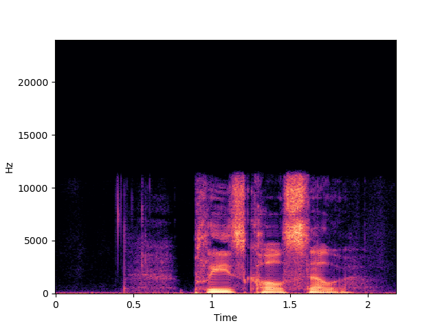                                                 | 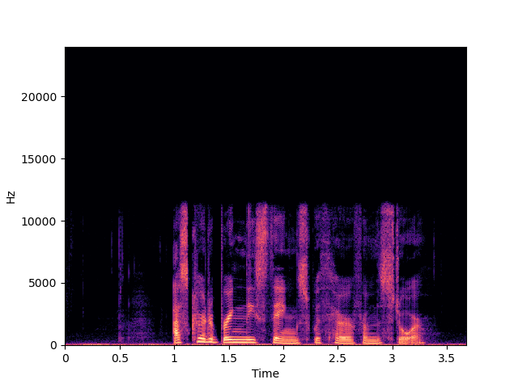                                                 |
| Input    | <audio src="samples/x2/p360_001_mic1.wav" controls="" preload=""></audio>         | <audio src="samples/x2/p361_002_mic1.wav" controls="" preload=""></audio>         |
|          | 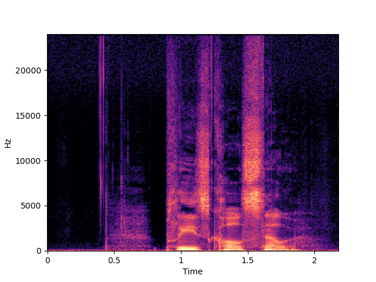                                             | 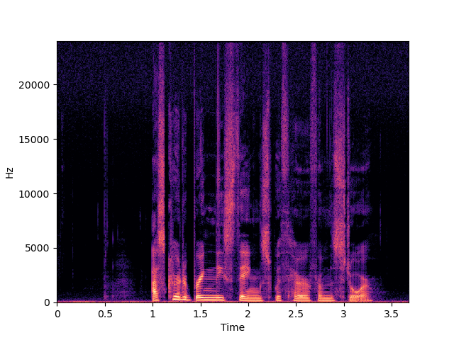                                             |
| Target   | <audio src="samples/origin/p360_001_mic1.wav" controls="" preload=""></audio>     | <audio src="samples/origin/p361_002_mic1.wav" controls="" preload=""></audio>     |
|          | 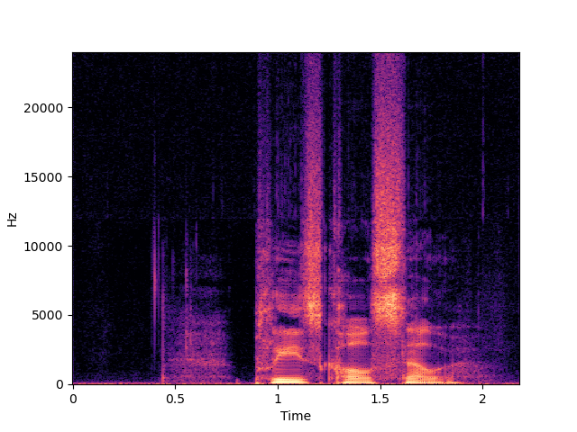                                          | 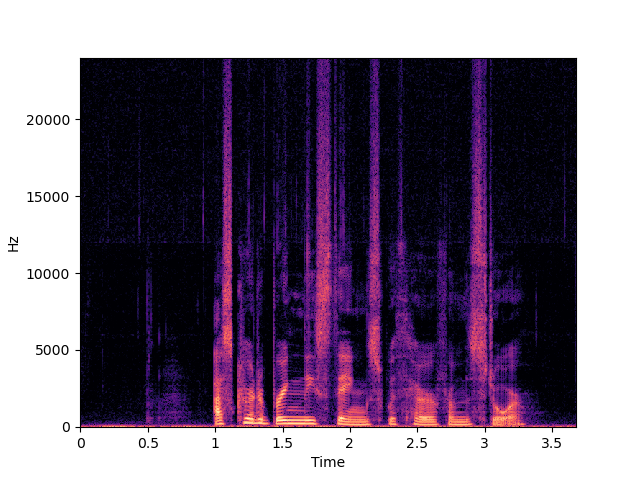                                          |
| NU-Wave  | <audio src="samples/x2-nuwave/p360_001_mic1.wav" controls="" preload=""></audio>  | <audio src="samples/x2-nuwave/p361_002_mic1.wav" controls="" preload=""></audio>  |
|          | 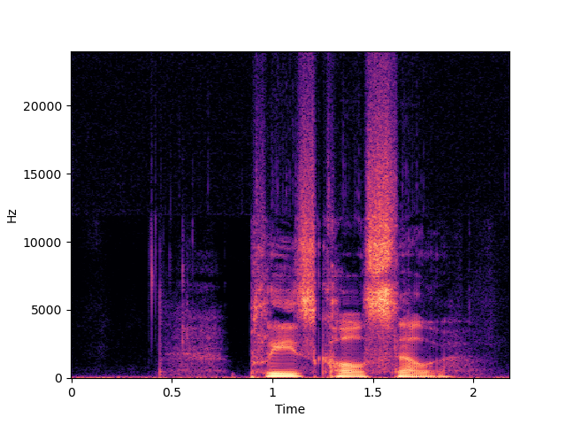                                         | 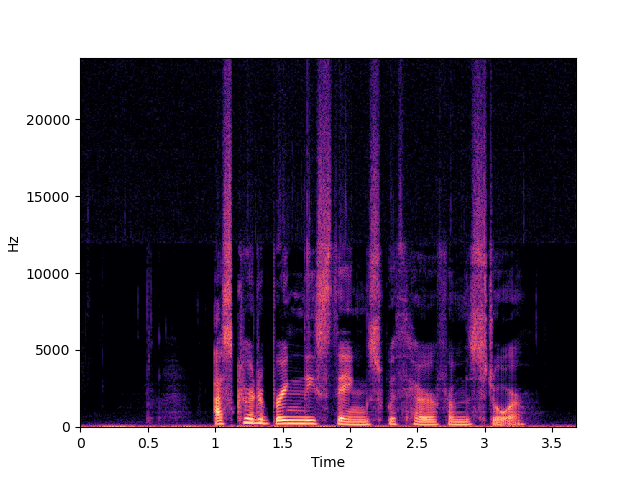                                         |
| NU-Wave+ | <audio src="samples/x2-nuwave+/p360_001_mic1.wav" controls="" preload=""></audio> | <audio src="samples/x2-nuwave+/p361_002_mic1.wav" controls="" preload=""></audio> |
|          | 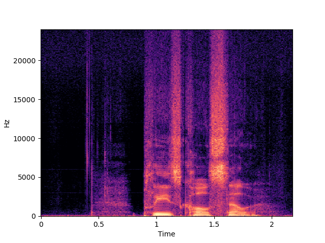                                         |                                          |
| WSRGlow  | <audio src="samples/x2-wsrglow/p360_001_mic1.wav" controls="" preload=""></audio> | <audio src="samples/x2-wsrglow/p361_002_mic1.wav" controls="" preload=""></audio> |
|          | 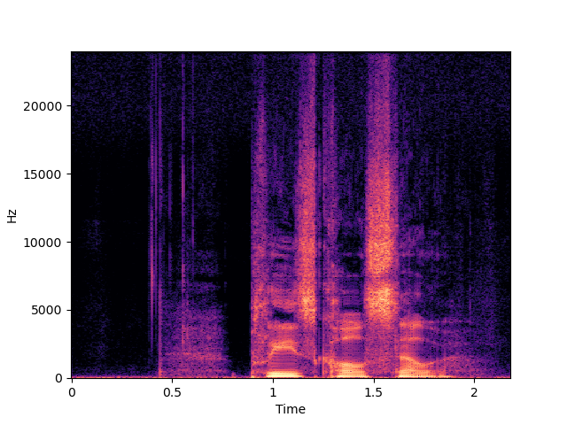                                             | 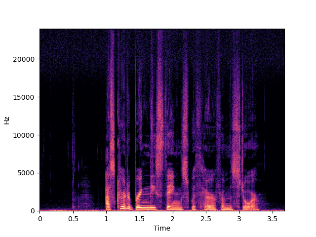                                             |
| Ours     | <audio src="samples/x2-mcg/p360_001_mic1.wav" controls="" preload=""></audio>     | <audio src="samples/x2-mcg/p361_002_mic1.wav" controls="" preload=""></audio>     |

<!-- | Input | Target | NU-Wave | NU-Wave+ | WSRGlow | Ours |
| ----- | ------ | ------- | -------- | ------- | ---- |
| <audio src="samples/x2/p360_001_mic1.wav" controls="" preload=""></audio> | <audio src="samples/origin/p360_001_mic1.wav" controls="" preload=""></audio> | <audio src="samples/x2-nuwave/p360_001_mic1.wav" controls="" preload=""></audio> | <audio src="samples/x2-nuwave+/p360_001_mic1.wav" controls="" preload=""></audio> | <audio src="samples/x2-wsrglow/p360_001_mic1.wav" controls="" preload=""></audio> | <audio src="samples/x2-mcg/p360_001_mic1.wav" controls="" preload=""></audio> |
| <audio src="samples/x2/p361_002_mic1.wav" controls="" preload=""></audio> | <audio src="samples/origin/p361_002_mic1.wav" controls="" preload=""></audio> | <audio src="samples/x2-nuwave/p361_002_mic1.wav" controls="" preload=""></audio> | <audio src="samples/x2-nuwave+/p361_002_mic1.wav" controls="" preload=""></audio> | <audio src="samples/x2-wsrglow/p361_002_mic1.wav" controls="" preload=""></audio> | <audio src="samples/x2-mcg/p361_002_mic1.wav" controls="" preload=""></audio> |
| <audio src="samples/x2/p362_003_mic1.wav" controls="" preload=""></audio> | <audio src="samples/origin/p362_003_mic1.wav" controls="" preload=""></audio> | <audio src="samples/x2-nuwave/p362_003_mic1.wav" controls="" preload=""></audio> | <audio src="samples/x2-nuwave+/p362_003_mic1.wav" controls="" preload=""></audio> | <audio src="samples/x2-wsrglow/p362_003_mic1.wav" controls="" preload=""></audio> | <audio src="samples/x2-mcg/p362_003_mic1.wav" controls="" preload=""></audio> | -->

## Samples: 16k to 48k, 50 steps

|          | p363_004                                                                          | p364_005                                                                          |
|----------|-----------------------------------------------------------------------------------|-----------------------------------------------------------------------------------|
|          | 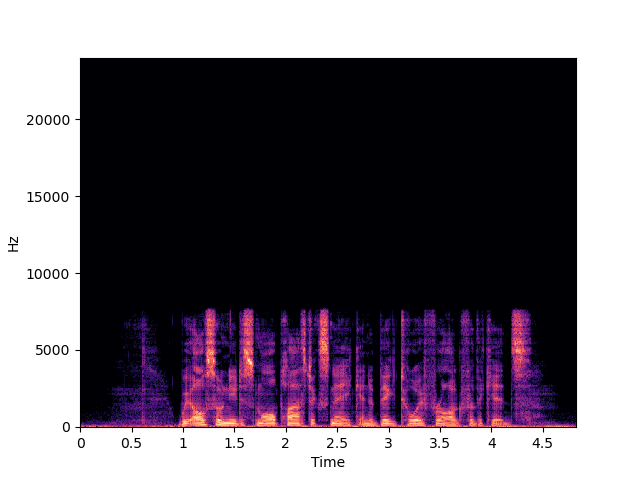                                                 | 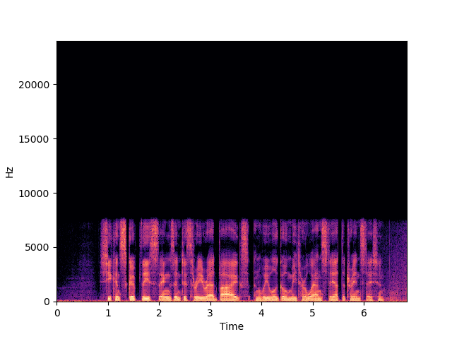                                                 |
| Input    | <audio src="samples/x3/p363_004_mic1.wav" controls="" preload=""></audio>         | <audio src="samples/x3/p364_005_mic1.wav" controls="" preload=""></audio>         |
|          | 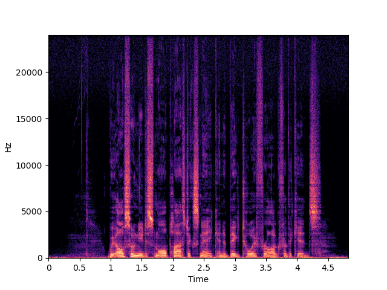                                             | 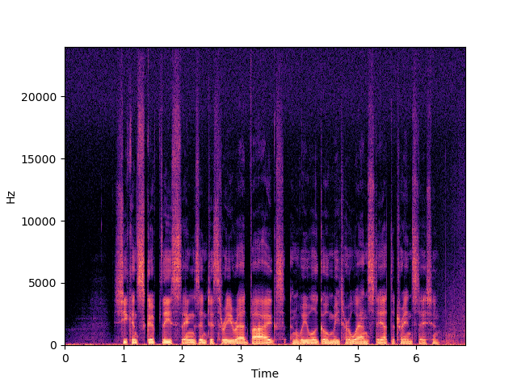                                             |
| Target   | <audio src="samples/origin/p363_004_mic1.wav" controls="" preload=""></audio>     | <audio src="samples/origin/p364_005_mic1.wav" controls="" preload=""></audio>     |
|          | 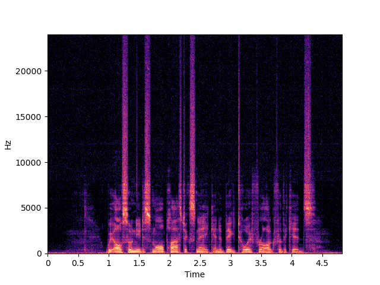                                          | 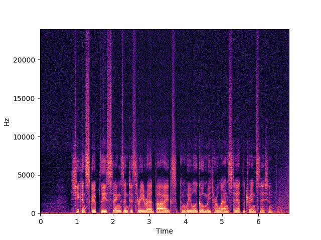                                          |
| NU-Wave  | <audio src="samples/x3-nuwave/p363_004_mic1.wav" controls="" preload=""></audio>  | <audio src="samples/x3-nuwave/p364_005_mic1.wav" controls="" preload=""></audio>  |
|          |                                          |                                          |
| NU-Wave+ | <audio src="samples/x3-nuwave+/p363_004_mic1.wav" controls="" preload=""></audio> | <audio src="samples/x3-nuwave+/p364_005_mic1.wav" controls="" preload=""></audio> |
|          | 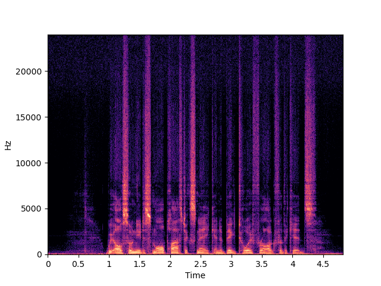                                         | 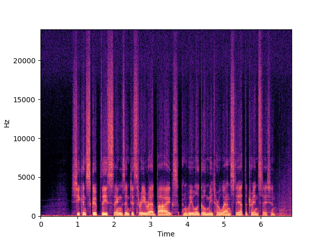                                         |
| WSRGlow  | <audio src="samples/x3-wsrglow/p363_004_mic1.wav" controls="" preload=""></audio> | <audio src="samples/x3-wsrglow/p364_005_mic1.wav" controls="" preload=""></audio> |
|          | 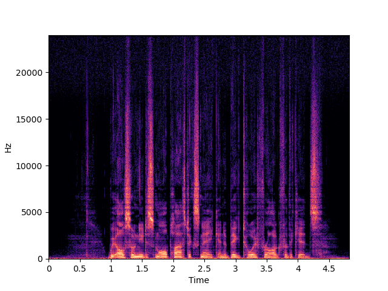                                             | 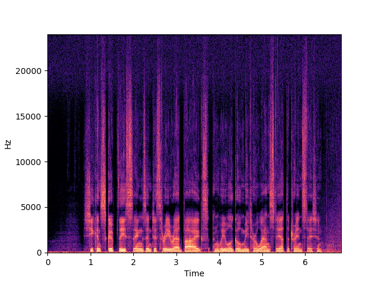                                             |
| Ours     | <audio src="samples/x2-mcg/p363_004_mic1.wav" controls="" preload=""></audio>     | <audio src="samples/x2-mcg/p364_005_mic1.wav" controls="" preload=""></audio>     |

<!-- | Input | Target | NU-Wave | NU-Wave+ | WSRGlow | Ours |
| ----- | ------ | ------- | -------- | ------- | ---- |
| <audio src="samples/x3/p363_004_mic1.wav" controls="" preload=""></audio> | <audio src="samples/origin/p363_004_mic1.wav" controls="" preload=""></audio> | <audio src="samples/x3-nuwave/p363_004_mic1.wav" controls="" preload=""></audio> | <audio src="samples/x3-nuwave+/p363_004_mic1.wav" controls="" preload=""></audio> | <audio src="samples/x3-wsrglow/p363_004_mic1.wav" controls="" preload=""></audio> | <audio src="samples/x3-mcg/p363_004_mic1.wav" controls="" preload=""></audio> |
| <audio src="samples/x3/p364_005_mic1.wav" controls="" preload=""></audio> | <audio src="samples/origin/p364_005_mic1.wav" controls="" preload=""></audio> | <audio src="samples/x3-nuwave/p364_005_mic1.wav" controls="" preload=""></audio> | <audio src="samples/x3-nuwave+/p364_005_mic1.wav" controls="" preload=""></audio> | <audio src="samples/x3-wsrglow/p364_005_mic1.wav" controls="" preload=""></audio> | <audio src="samples/x3-mcg/p364_005_mic1.wav" controls="" preload=""></audio> |
| <audio src="samples/x3/p374_006_mic1.wav" controls="" preload=""></audio> | <audio src="samples/origin/p374_006_mic1.wav" controls="" preload=""></audio> | <audio src="samples/x3-nuwave/p374_006_mic1.wav" controls="" preload=""></audio> | <audio src="samples/x3-nuwave+/p374_006_mic1.wav" controls="" preload=""></audio> | <audio src="samples/x3-wsrglow/p374_006_mic1.wav" controls="" preload=""></audio> | <audio src="samples/x3-mcg/p374_006_mic1.wav" controls="" preload=""></audio> | -->

<!-- ## Samples: 12k to 48k, 200 steps

| Input | Target | WSRGlow | Ours |
| ----- | ------ | ------- | ---- |
| <audio src="samples/x4/p376_007_mic1.wav" controls="" preload=""></audio> | <audio src="samples/origin/p376_007_mic1.wav" controls="" preload=""></audio> | <audio src="samples/x4-wsrglow/p376_007_mic1.wav" controls="" preload=""></audio> | <audio src="samples/x4-mcg-T200/p376_007_mic1.wav" controls="" preload=""></audio> |
| <audio src="samples/x4/s5_008_mic1.wav" controls="" preload=""></audio> | <audio src="samples/origin/s5_008_mic1.wav" controls="" preload=""></audio> | <audio src="samples/x4-wsrglow/s5_008_mic1.wav" controls="" preload=""></audio> | <audio src="samples/x4-mcg-T200/s5_008_mic1.wav" controls="" preload=""></audio> | -->