Recently, diffusion models (DMs) have been increasingly used in audio processing tasks, including speech super-resolution (SR), which aims to restore high-frequency content given low-resolution speech utterances.
This is commonly achieved by conditioning the network of noise predictor with low-resolution audio.
In this paper, we propose a novel sampling algorithm that communicates the information of the low-resolution audio via the reverse sampling process of DMs.
The proposed method can be a drop-in replacement for the vanilla sampling process and can significantly improve the performance of the existing works.
Moreover, by coupling the proposed sampling method with an unconditional DM, i.e., a DM with no auxiliary inputs to its noise predictor, we can generalize it to a wide range of SR setups.
We also attain state-of-the-art results on the VCTK Multi-Speaker benchmark with this novel formulation.

## Animation of the Bandwidth Extension Process (200 steps, 12k to 48k)

We recommend reader listen to the samples when reading the paper.
All utterances were randomly picked from the VCTK test set.

## Samples: 24k to 48k, 50 steps

We recommend using headphones for this section.

|            | p360_001                                                                           | p361_002                                                                           |
|------------|------------------------------------------------------------------------------------|------------------------------------------------------------------------------------|
|            |                                                   |                                                   |
| Input      | <audio src="samples/x2/p360_001_mic1.wav" controls="" preload=""></audio>          | <audio src="samples/x2/p361_002_mic1.wav" controls="" preload=""></audio>          |
|            |                                               |                                               |
| Target     | <audio src="samples/origin/p360_001_mic1.wav" controls="" preload=""></audio>      | <audio src="samples/origin/p361_002_mic1.wav" controls="" preload=""></audio>      |
|            |                                            |                                            |
| NU-Wave    | <audio src="samples/x2-nuwave/p360_001_mic1.wav" controls="" preload=""></audio>   | <audio src="samples/x2-nuwave/p361_002_mic1.wav" controls="" preload=""></audio>   |
|            |                                           |                                           |
| NU-Wave+   | <audio src="samples/x2-nuwave+/p360_001_mic1.wav" controls="" preload=""></audio>  | <audio src="samples/x2-nuwave+/p361_002_mic1.wav" controls="" preload=""></audio>  |
|            | 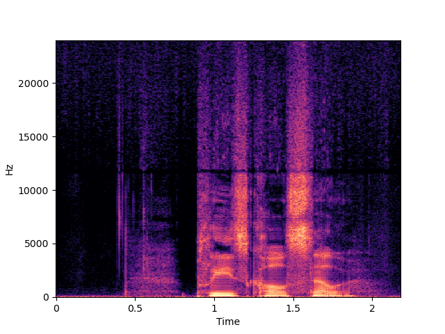                                          | 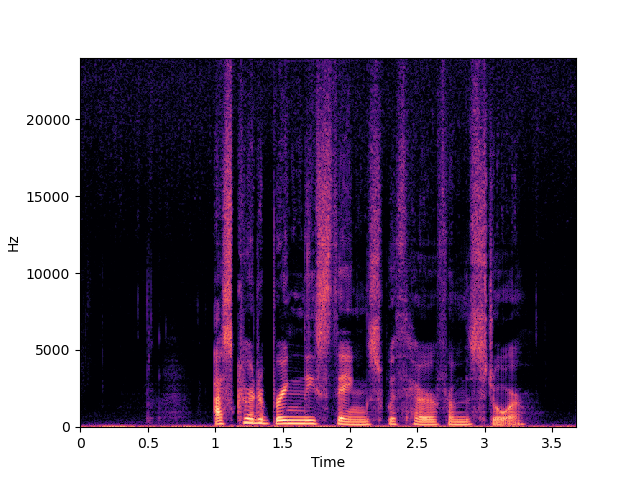                                          |
| NU-Wave 2  | <audio src="samples/x2-nuwave2/p360_001_mic1.wav" controls="" preload=""></audio>  | <audio src="samples/x2-nuwave2/p361_002_mic1.wav" controls="" preload=""></audio>  |
|            |                                          |                                          |
| NU-Wave 2+ | <audio src="samples/x2-nuwave2+/p360_001_mic1.wav" controls="" preload=""></audio> | <audio src="samples/x2-nuwave2+/p361_002_mic1.wav" controls="" preload=""></audio> |
|            |                                           |                                           |
| WSRGlow    | <audio src="samples/x2-wsrglow/p360_001_mic1.wav" controls="" preload=""></audio>  | <audio src="samples/x2-wsrglow/p361_002_mic1.wav" controls="" preload=""></audio>  |
|            |                                               |                                               |
| UDM+       | <audio src="samples/x2-mcg/p360_001_mic1.wav" controls="" preload=""></audio>      | <audio src="samples/x2-mcg/p361_002_mic1.wav" controls="" preload=""></audio>      |

## Samples: 16k to 48k, 50 steps

We recommend using headphones for this section.

|            | p363_004                                                                           | p364_005                                                                           |
|------------|------------------------------------------------------------------------------------|------------------------------------------------------------------------------------|
|            |                                                   |                                                   |
| Input      | <audio src="samples/x3/p363_004_mic1.wav" controls="" preload=""></audio>          | <audio src="samples/x3/p364_005_mic1.wav" controls="" preload=""></audio>          |
|            |                                               |                                               |
| Target     | <audio src="samples/origin/p363_004_mic1.wav" controls="" preload=""></audio>      | <audio src="samples/origin/p364_005_mic1.wav" controls="" preload=""></audio>      |
|            |                                            |                                            |
| NU-Wave    | <audio src="samples/x3-nuwave/p363_004_mic1.wav" controls="" preload=""></audio>   | <audio src="samples/x3-nuwave/p364_005_mic1.wav" controls="" preload=""></audio>   |
|            |                                           |                                           |
| NU-Wave+   | <audio src="samples/x3-nuwave+/p363_004_mic1.wav" controls="" preload=""></audio>  | <audio src="samples/x3-nuwave+/p364_005_mic1.wav" controls="" preload=""></audio>  |
|            | 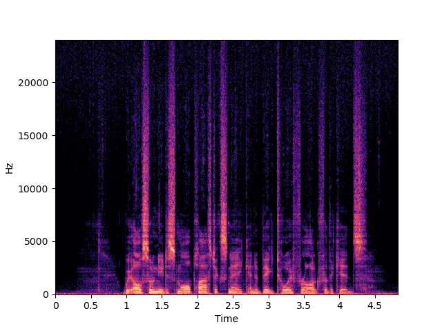                                          | 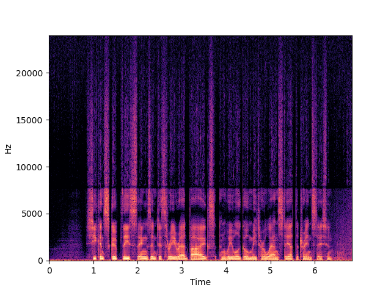                                          |
| NU-Wave 2  | <audio src="samples/x3-nuwave2/p363_004_mic1.wav" controls="" preload=""></audio>  | <audio src="samples/x3-nuwave2/p364_005_mic1.wav" controls="" preload=""></audio>  |
|            | 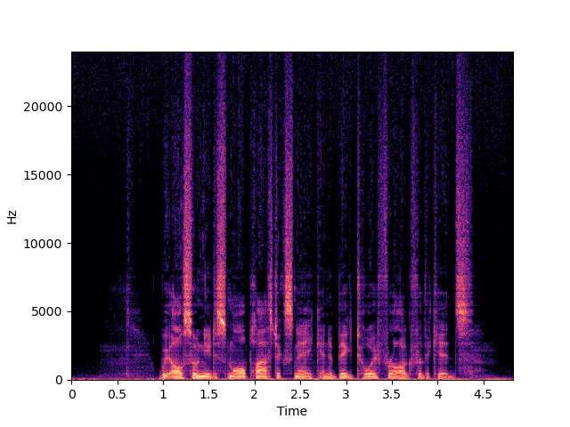                                         | 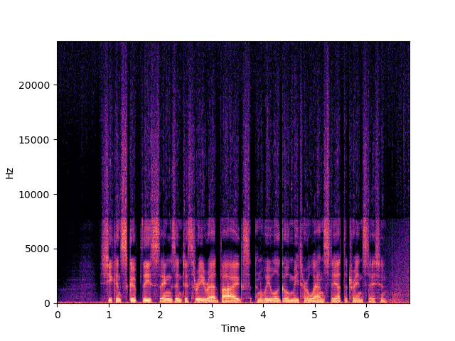                                         |
| NU-Wave 2+ | <audio src="samples/x3-nuwave2+/p363_004_mic1.wav" controls="" preload=""></audio> | <audio src="samples/x3-nuwave2+/p364_005_mic1.wav" controls="" preload=""></audio> |
|            |                                           |                                           |
| WSRGlow    | <audio src="samples/x3-wsrglow/p363_004_mic1.wav" controls="" preload=""></audio>  | <audio src="samples/x3-wsrglow/p364_005_mic1.wav" controls="" preload=""></audio>  |
|            |                                               |                                               |
| UDM+       | <audio src="samples/x3-mcg/p363_004_mic1.wav" controls="" preload=""></audio>      | <audio src="samples/x3-mcg/p364_005_mic1.wav" controls="" preload=""></audio>      |

## Samples: 8k to 16k, 50 steps

|                    | p374_012                                                                                      | p376_233                                                                                      |
|--------------------|-----------------------------------------------------------------------------------------------|-----------------------------------------------------------------------------------------------|
|                    | 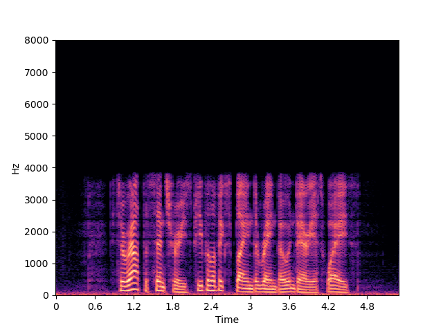                                                         | 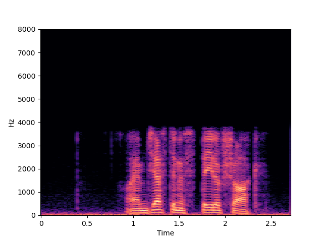                                                         |
| Input              | <audio src="samples/16k/x2/p374_012_mic1.wav" controls="" preload=""></audio>                 | <audio src="samples/16k/x2/p376_233_mic1.wav" controls="" preload=""></audio>                 |
|                    | 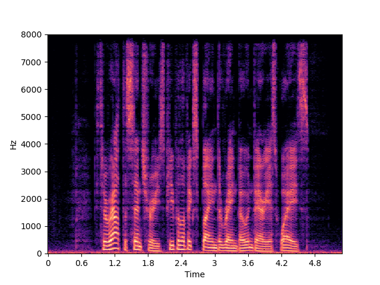                                                     | 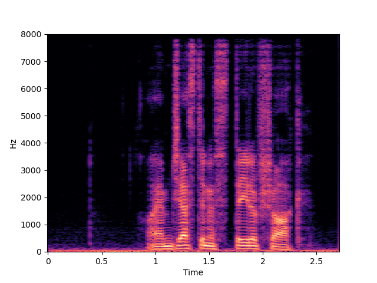                                                     |
| Target             | <audio src="samples/16k/origin/p374_012_mic1.wav" controls="" preload=""></audio>             | <audio src="samples/16k/origin/p376_233_mic1.wav" controls="" preload=""></audio>             |
|                    | 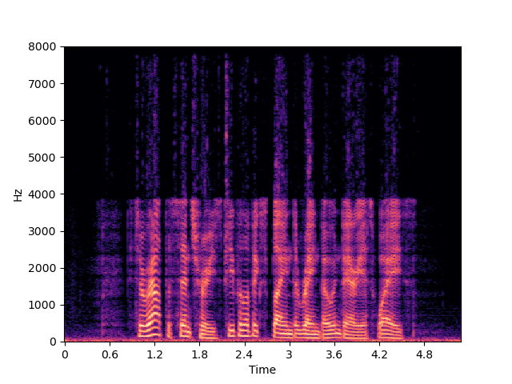                                                 | 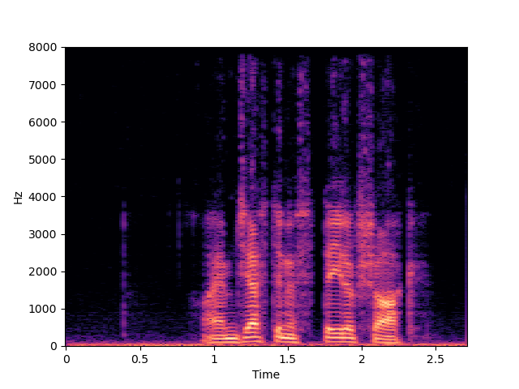                                                 |
| NU-Wave 2          | <audio src="samples/16k/x2-nuwave2/p374_012_mic1.wav" controls="" preload=""></audio>         | <audio src="samples/16k/x2-nuwave2/p376_233_mic1.wav" controls="" preload=""></audio>         |
|                    | 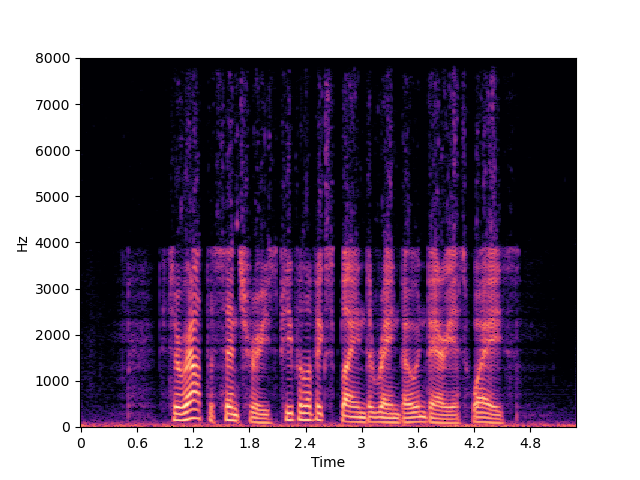                                                | 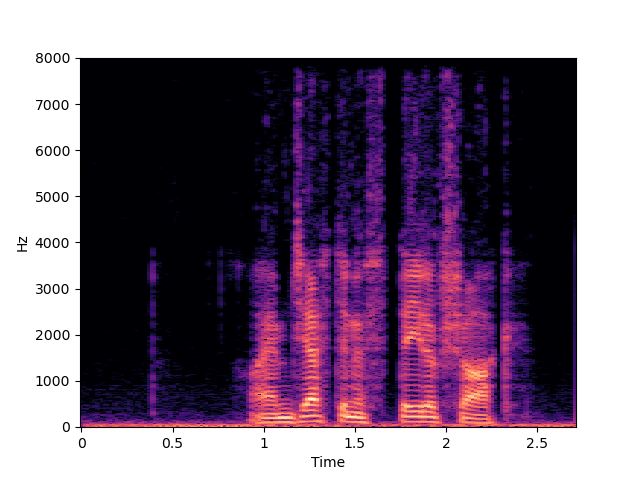                                                |
| NU-Wave 2+         | <audio src="samples/16k/x2-nuwave2+/p374_012_mic1.wav" controls="" preload=""></audio>        | <audio src="samples/16k/x2-nuwave2+/p376_233_mic1.wav" controls="" preload=""></audio>        |
|                    |                                          | 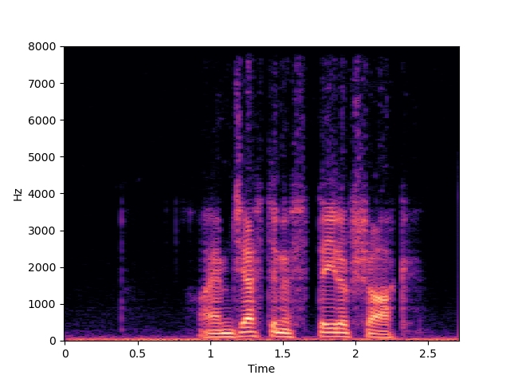                                         |
| NU-Wave 2+ w/o MCG | <audio src="samples/16k/x2-nuwave2-inpaint/p374_012_mic1.wav" controls="" preload=""></audio> | <audio src="samples/16k/x2-nuwave2-inpaint/p376_233_mic1.wav" controls="" preload=""></audio> |
|                    | 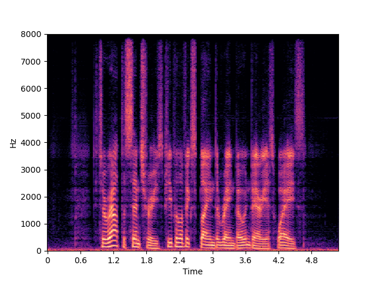                                                    | 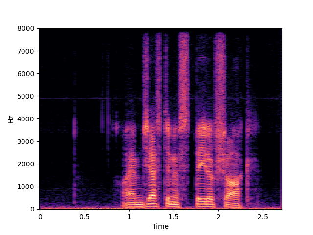                                                    |
| NVSR               | <audio src="samples/16k/x2-nvsr/p374_012_mic1.wav" controls="" preload=""></audio>            | <audio src="samples/16k/x2-nvsr/p376_233_mic1.wav" controls="" preload=""></audio>            |
|                    | 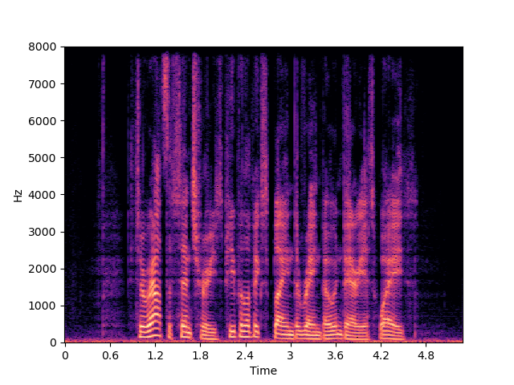                                                     | 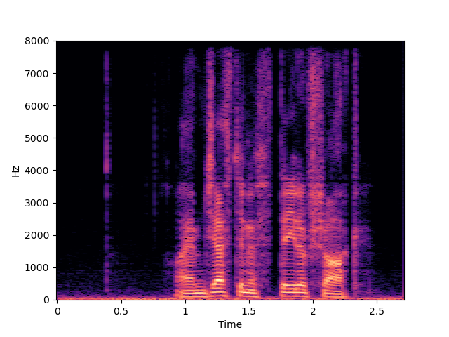                                                     |
| UDM+               | <audio src="samples/16k/x2-mcg/p374_012_mic1.wav" controls="" preload=""></audio>             | <audio src="samples/16k/x2-mcg/p376_233_mic1.wav" controls="" preload=""></audio>             |
|                    | 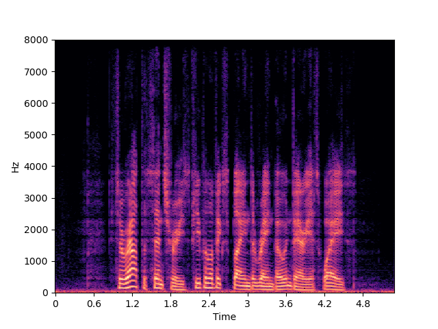                                                 | 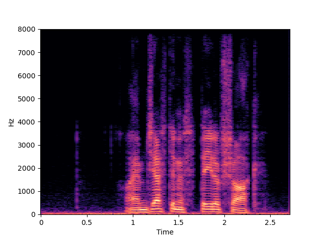                                                 |
| UDM+ w/o MCG       | <audio src="samples/16k/x2-inpaint/p374_012_mic1.wav" controls="" preload=""></audio>         | <audio src="samples/16k/x2-inpaint/p376_233_mic1.wav" controls="" preload=""></audio>         |

## Unconditional Samples

In this section, the samples were generated unconditionally, using our noise predictor with 100 steps.

### Ancestral Sampling

<audio src="samples/uncond/0.wav" controls="" preload=""></audio> 
<audio src="samples/uncond/1.wav" controls="" preload=""></audio> 
<audio src="samples/uncond/2.wav" controls="" preload=""></audio> 

### DDIM

<audio src="samples/uncond/ddim/0.wav" controls="" preload=""></audio> 
<audio src="samples/uncond/ddim/1.wav" controls="" preload=""></audio> 
<audio src="samples/uncond/ddim/2.wav" controls="" preload=""></audio> 